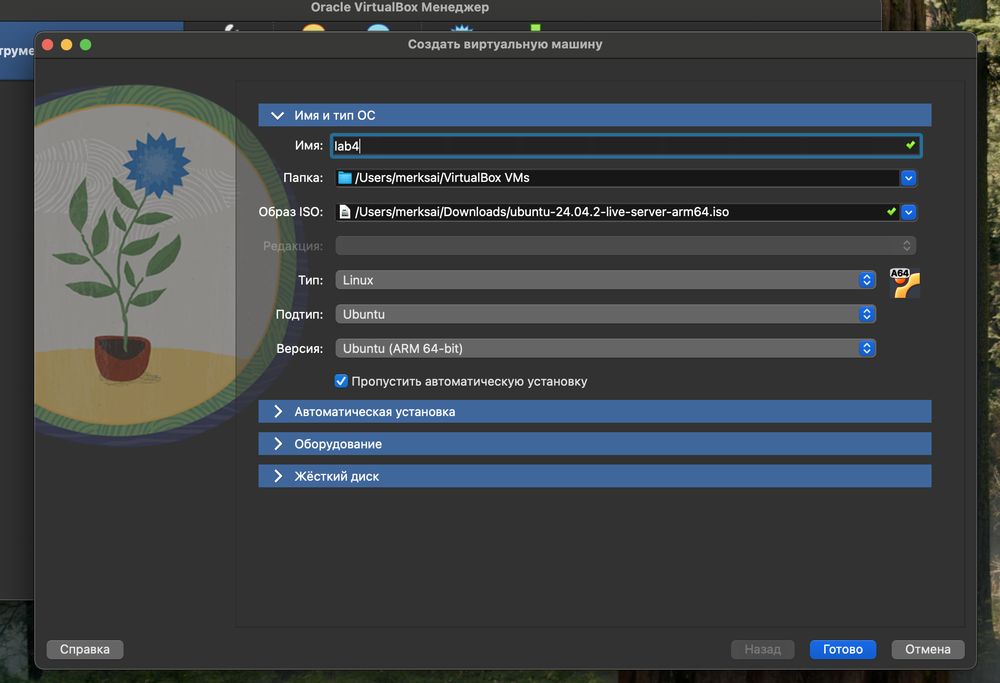
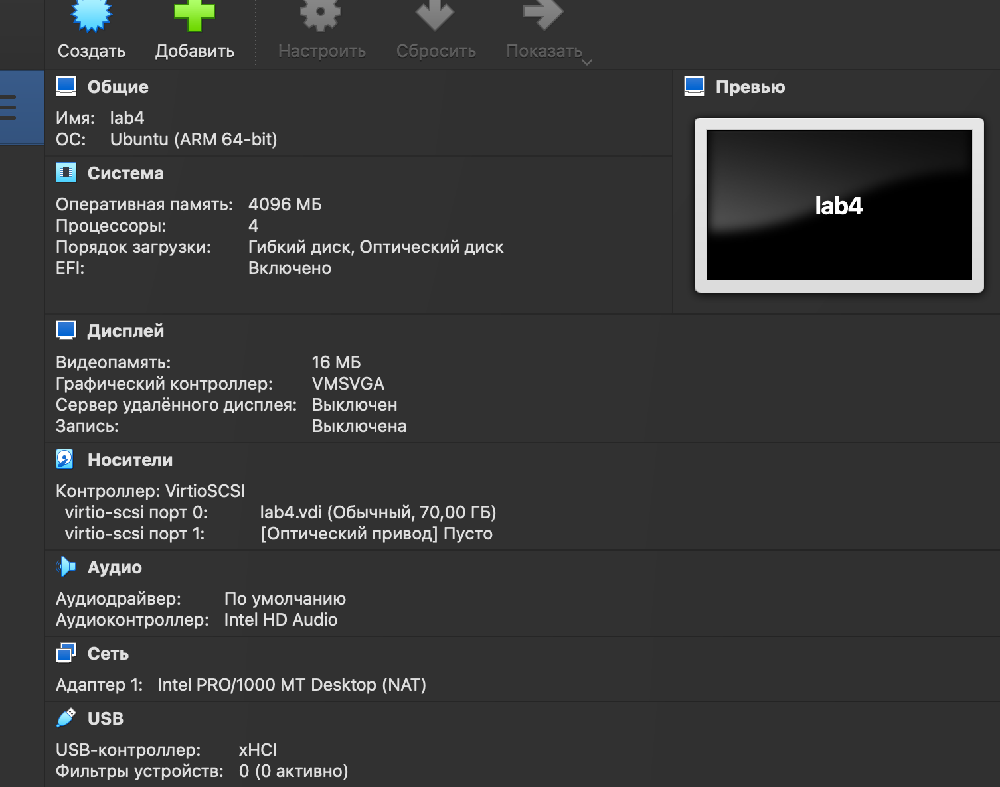
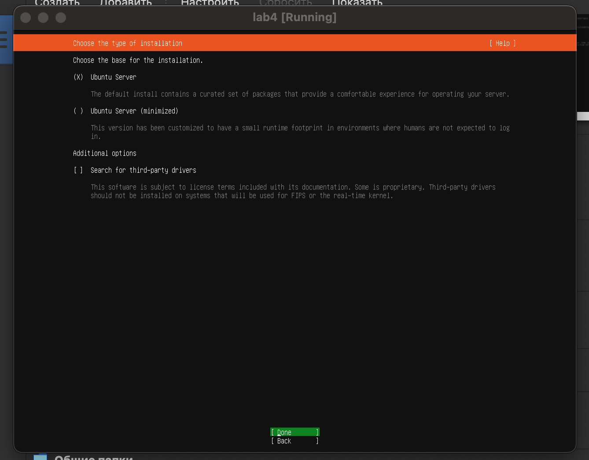
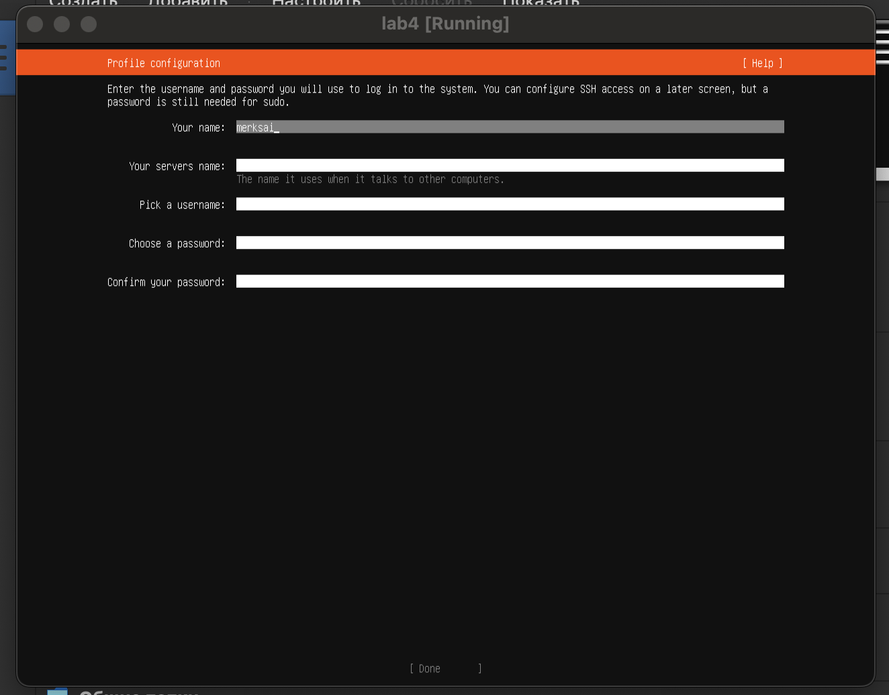
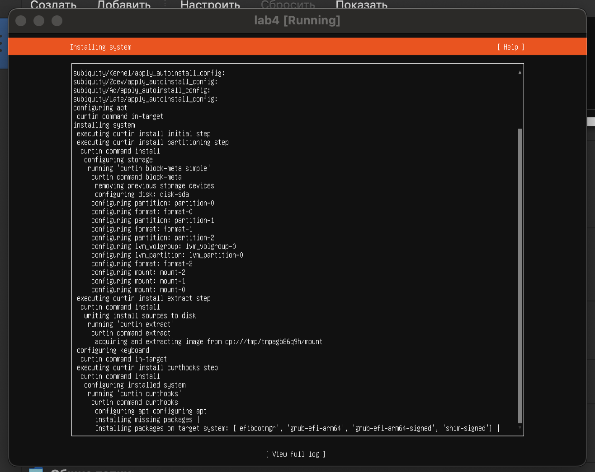
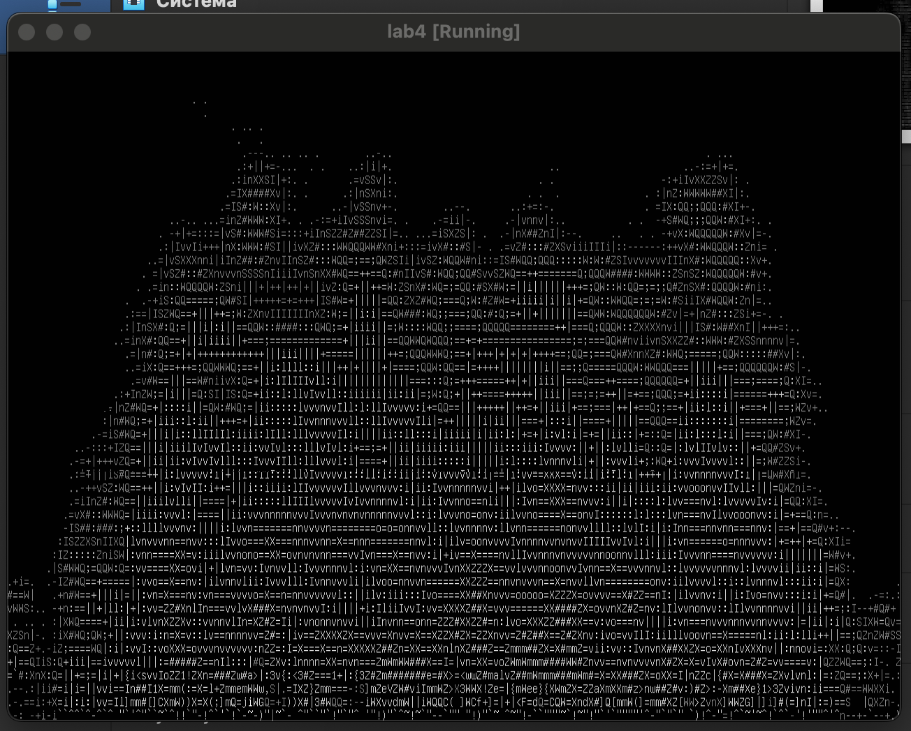
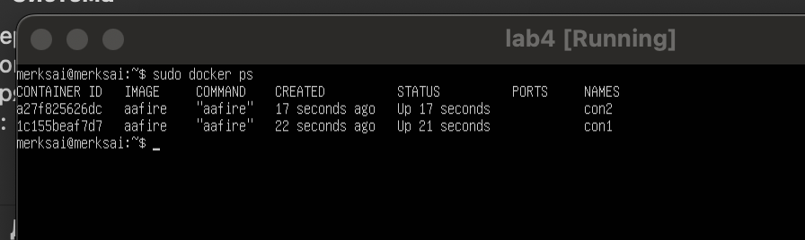
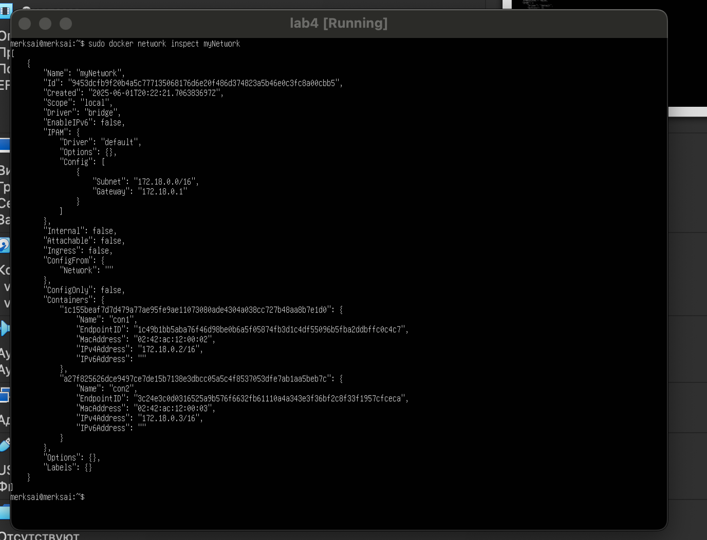
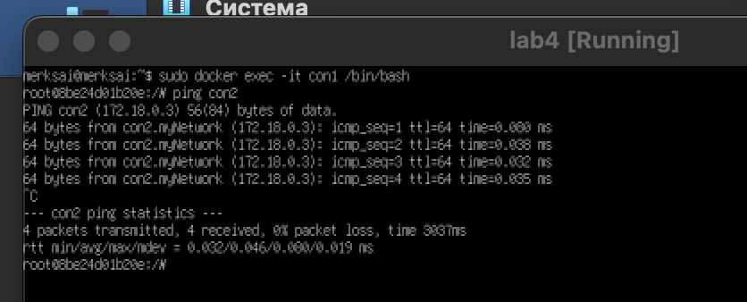
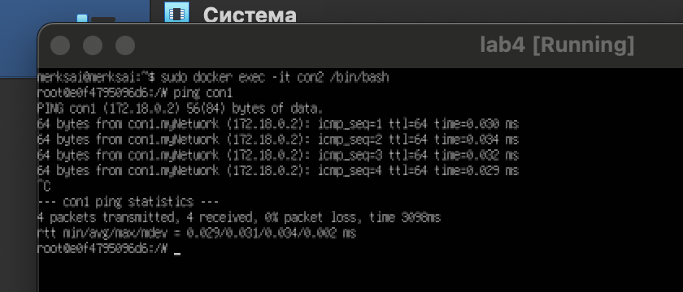

# Лабораторная работа 4.

## Шаги работы:

1. Устанавливаем ubuntu live server.





2. Создаем Dockerfile.
```
FROM ubuntu:latest
RUN apt-get update && apt-get install -y libaa-bin
CMD ["aafire"]
```
3. Собираем образ.
```
docker build -t aafire .
```
4. Запускаем контейнер.
```
docker run -it aafire
```

5. Добавляем в Dockerfile установку ping.
```
FROM ubuntu:latest
RUN apt-get update && apt-get install -y libaa-bin iputils-ping
CMD ["aafire"]
```
6. Пересобираем образ.
```
docker build -t aafire .
```
7. Запускаем контейнеры.
```
docker run -dit --name con1 aafire
docker run -dit --name con2 aafire
```
8. Проверяем работают ли контейнеры.

9. Создаем сеть.
```
docker network create myNetwork
```
10. Подключаем контейнеры к сети.
```
docker network connect myNetwork con1
docker network connect myNetwork con2
```
11. Смотрим настройки созданной сети.
```
docker network inspect myNetwork
```

12. Подключаемся к контейнерам и проверяем соединение между ними.
```
docker exec -it con1 /bin/bash
ping con2
```
```
docker exec -it con2 /bin/bash
ping con1
```


